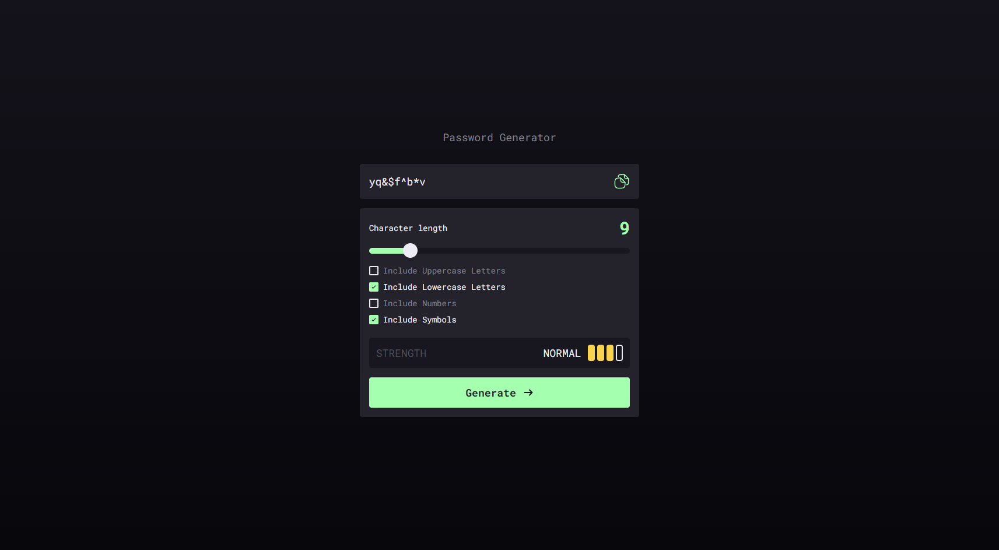
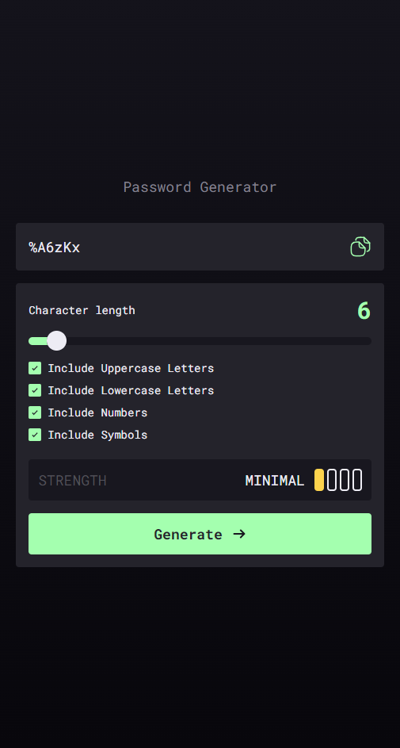

# Password Generator

Simple password generator made with VUE. User can change password length, types of chars. Easy copy with button near generated password and indicators that shows the complexity of password selection.

## Table of contents

- [Overview](#overview)
    - [The challenge](#the-challenge)
    - [Screenshot](#screenshot)
    - [Links](#links)
- [My process](#my-process)
    - [Built with](#built-with)
    - [What I learned](#what-i-learned)
    - [Useful resources](#useful-resources)
- [Author](#author)


## Overview

### The challenge

Your users should be able to:

- Generate a password based on the selected inclusion options
- Copy the generated password to the computer's clipboard
- See a strength rating for their generated password
- View the optimal layout for the interface depending on their device's screen size
- See hover and focus states for all interactive elements on the page

### Screenshot




### Links

- Live Site URL: [Add live site URL here](https://your-live-site-url.com)

## My process

### Built with

- Semantic HTML5 markup
- CSS custom properties
- Flexbox
- Mobile-first workflow
- [VUE](https://vuejs.org/) - VUE framework
- [Styled Components](https://tailwindcss.ru/) - For styles

### What I learned

Making a custom slider with progress background fill became tricky part, that's how i managed it:

```html
<div class="slider-container relative">
  <input class="slider w-full" type="range" v-model="passwordLength" min="4" max="40" step="1">
  <input class="slider-thumb-m" type="range" v-model="passwordLength" min="4" max="40" step="1">
</div>
```

Basically it's two input fields in div container. First input handles slider background and fill, while second one shows thumb. You can change bg-color, fill-color and thumb as you want, also it's easy to implement, no other plugins needed.

```css

.slider-container{
  @apply relative w-full my-4 flex flex-col justify-center;
}

.slider-thumb-m[type='range']{
  transition: opacity .2s;
  -webkit-appearance: none;
  appearance: none;
  @apply absolute left-0 top-0 right-0 bottom-0 bg-transparent;
  background-color: transparent;
}

.slider {
  -webkit-appearance: none;  
  appearance: none;
  outline: none; 
  -webkit-transition: .2s; 
  transition: opacity .2s;
  overflow: hidden;
  @apply bg-dark-gray-400 h-[10px] rounded-full w-full;
}

.slider:hover {
  opacity: 1;
}

.slider::-webkit-slider-thumb {
  -webkit-appearance: none;
  @apply bg-transparent cursor-default w-[24px] h-[24px] relative rounded-full;
  box-shadow: -410px 0px 0px 400px #A4FFAF;
}

.slider::-moz-range-thumb {
  -webkit-appearance: none;
  @apply bg-transparent cursor-default w-[24px] h-[24px] rounded-full border-solid border-4;
  box-shadow: -400px 0 0 400px #A4FFAF;
}

.slider::-moz-range-progress {
  -webkit-appearance: none;
  appearance: none;
  @apply bg-white;
}

```

### Useful resources

- [Google Fonts](https://fonts.google.com/)

